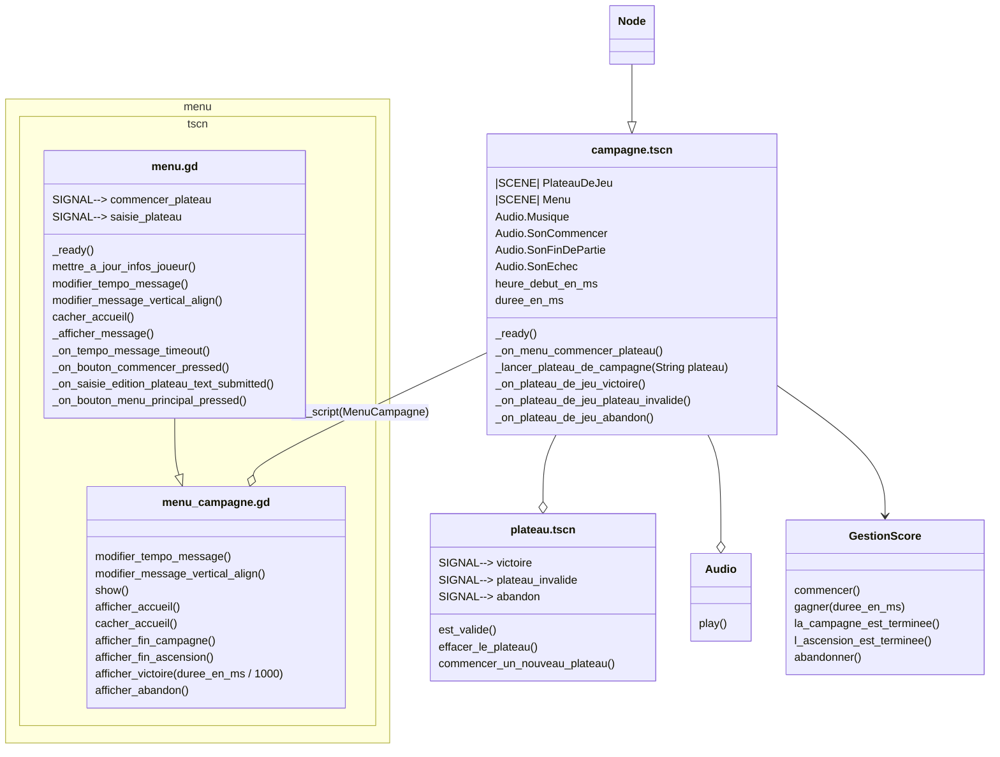

# Scene "Campagne"

## Description

Cette classe correspond à la scène de la campagne. Cette classe doit gerer les victoires, les defaites du joueur et lui faire suivre un chemin de plateaux en fonction de sa réussite. La campagne enregistre aussi des indicateurs (nombre de parties, avancement dans les plateaux, temps de résolution ...) afin de pouvoir calculer le score du joueur. C'est la campagne qui enregistre l'avancement du joueur dans l'ensemble des plateaux existants.

## Diagramme de classe

