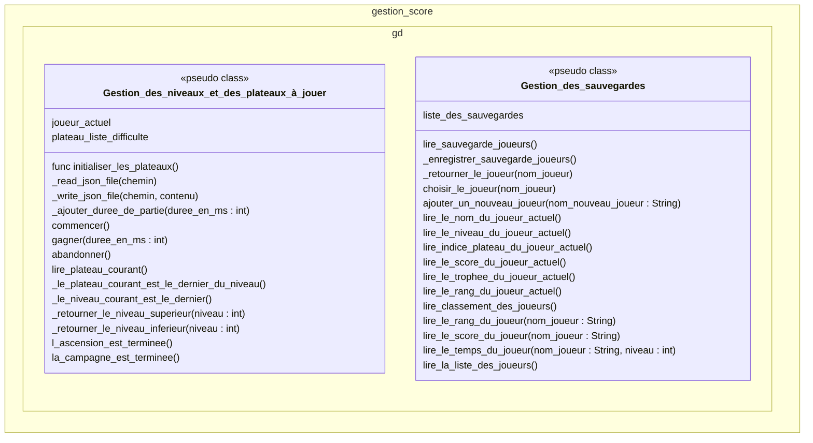

# Scene "GestionScore"

## Description

Cette classe correspond à un singleton accessible depuis toutes les scènes. Il gère le système de sauvegarde de la progression, la gestion du joueur courant, l'enchainement des plateaux pour la campagne, la consultation du fichier des plateaux de jeux (Solutions_classees.json) et l'enregistrement des indicateurs pour le calcul du score.

## Diagramme de classe

