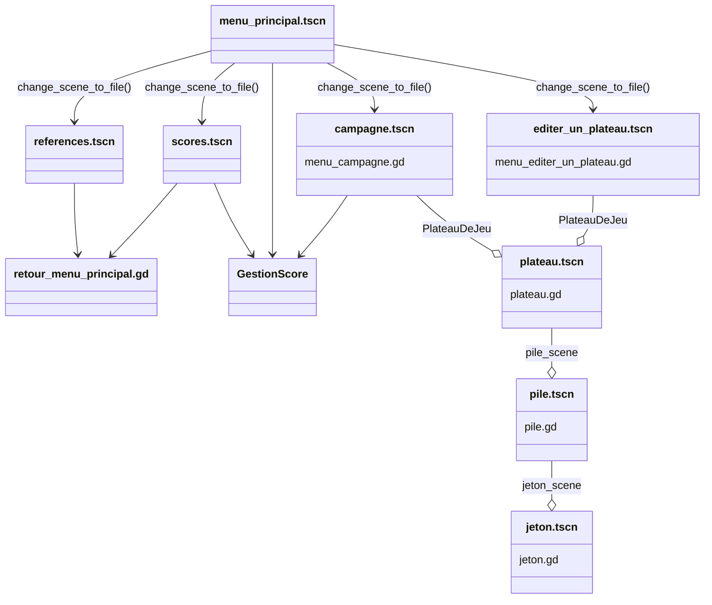

# Scene "Godot-Color-Sort-For-Anna"

## Description

Vue d'ensemble du jeu et de ses différentes classes.

## Diagramme de classe

```mermaid
classDiagram
menu_principal.tscn --> references.tscn : change_scene_to_file()
menu_principal.tscn --> scores.tscn : change_scene_to_file()
menu_principal.tscn --> GestionScore
menu_principal.tscn --> campagne.tscn : change_scene_to_file()
menu_principal.tscn --> editer_un_plateau.tscn : change_scene_to_file()

class campagne.tscn {
    menu_campagne.gd
}
campagne.tscn --> GestionScore
campagne.tscn --o plateau.tscn : PlateauDeJeu

class editer_un_plateau.tscn {
    menu_editer_un_plateau.gd
}
editer_un_plateau.tscn --o plateau.tscn : PlateauDeJeu

references.tscn --> retour_menu_principal.gd
scores.tscn --> retour_menu_principal.gd
scores.tscn --> GestionScore

class plateau.tscn {
    plateau.gd
}
plateau.tscn --o pile.tscn : pile_scene

class pile.tscn {
    pile.gd
}
pile.tscn --o jeton.tscn : jeton_scene

class jeton.tscn {
    jeton.gd
}
```
