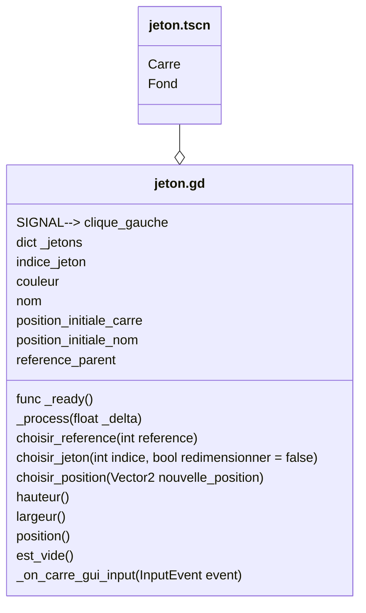

# Scene "Jeton"

## Description

Cette classe correspond à la scene d'un jeton. Le jeton est l'element de jeu le plus petit et le plus visible sur le plateau. Il a plusieurs apparences.

## Diagramme de classe

