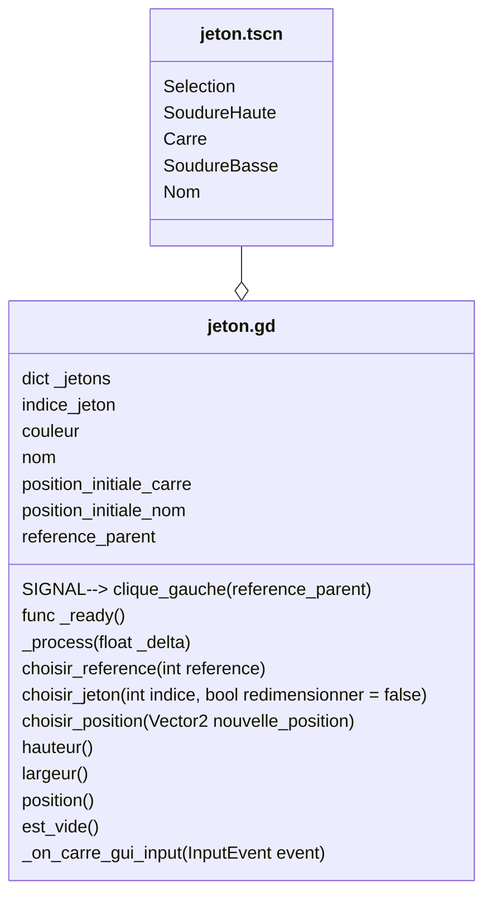

# Scene "Jeton"

## Description

Cette classe correspond à la scène d'un jeton. Le jeton est l'élément de jeu le plus petit et le plus visible sur le plateau. Il a plusieurs apparences et peut être manipulé par l'utilisateur.

## Diagramme de classe

## Détails des noeuds dans jeton.tscn

- **Jeton (Node)** : Racine de la scène.
- **Selection (ColorRect)** : Indique la sélection du jeton, invisible par défaut.
- **SoudureHaute (ColorRect)** : Partie supérieure du jeton, invisible par défaut.
- **Carre (ColorRect)** : Représentation principale du jeton.
- **SoudureBasse (ColorRect)** : Partie inférieure du jeton, invisible par défaut.
- **Nom (Label)** : Affiche le nom ou la lettre associée au jeton.

## Propriétés importantes dans jeton.gd

- **_jetons** : Dictionnaire contenant les différentes apparences possibles des jetons.
- **indice_jeton** : Indice du jeton actuel.
- **position_initiale_carre** : Position initiale du noeud "Carre".
- **position_initiale_nom** : Position initiale du noeud "Nom".
- **reference_parent** : Référence pour identifier le parent du jeton.

## Signaux

- **clique_gauche(reference_parent)** : Signal émis lors d'un clic gauche sur le jeton.

## Méthodes principales

- **_ready()** : Initialise les positions des noeuds enfants.
- **_on_carre_gui_input(event)** : Gère les interactions utilisateur sur le jeton.