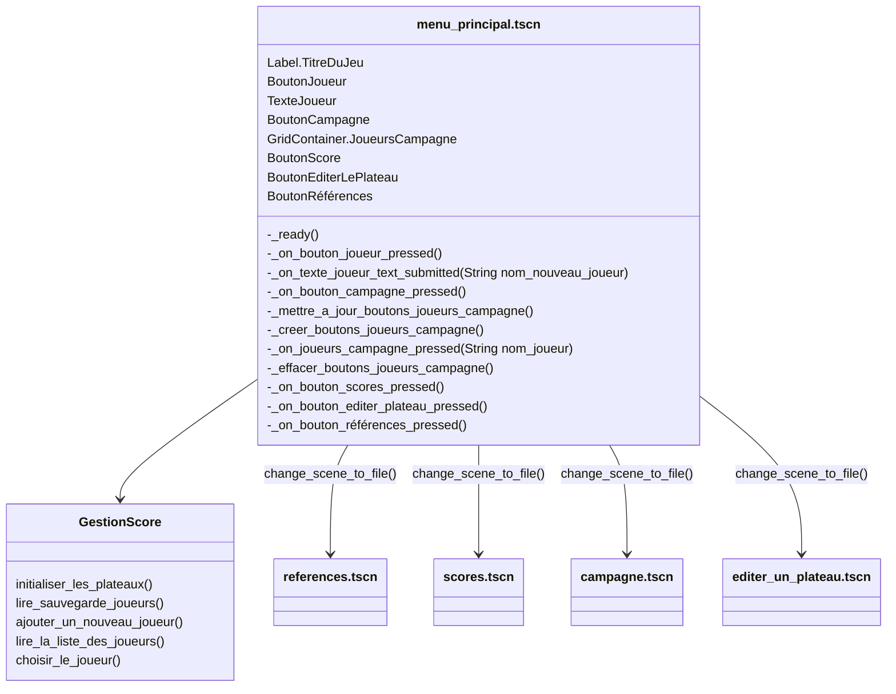

# Scene "MenuPrincipal"

## Description

Cette classe est le point d'entrée du projet GODOT. Elle représente le 1er menu de l'IHM et oriente vers les différentes activités.

## Diagramme de classe

