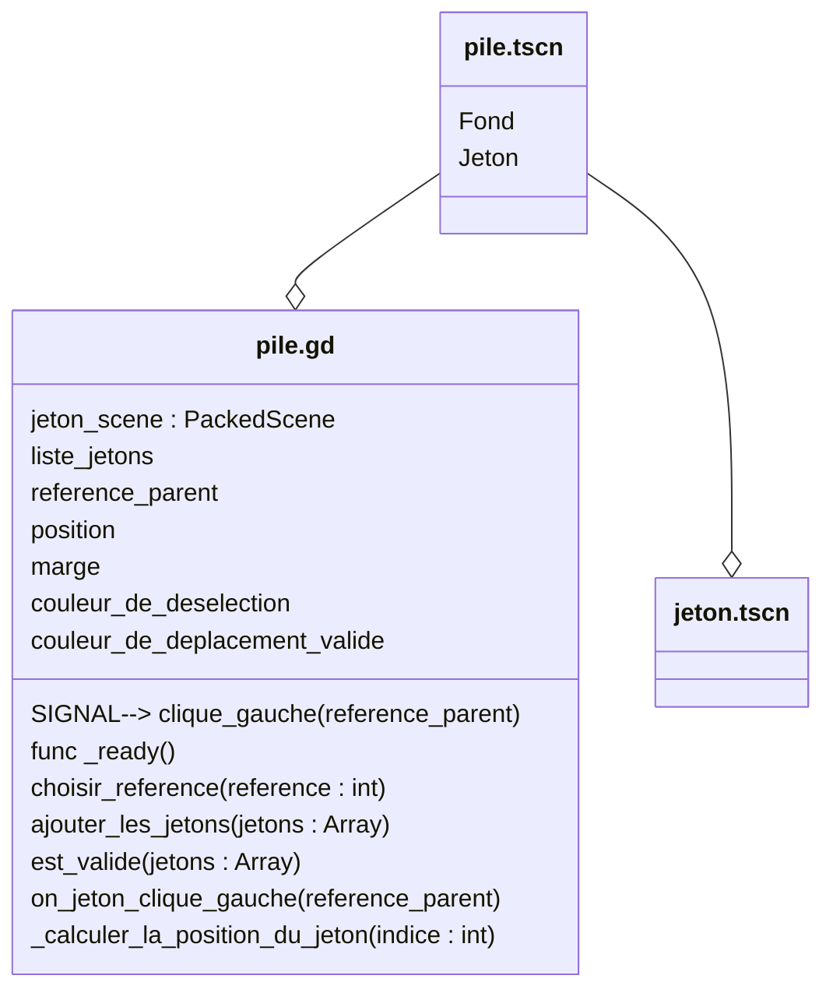

# Scene "Pile"

## Description

Cette classe correspond à la scène d'une pile. Une pile est un ensemble de jetons empilés verticalement, qui peuvent être manipulés et organisés par l'utilisateur.

## Diagramme de classe

## Détails des noeuds dans pile.tscn

- **Pile (Node)** : Racine de la scène.
- **Fond (ColorRect)** : Fond de la pile, utilisé pour indiquer les états de sélection ou de validité.
- **Jeton (PackedScene)** : Scène externe représentant un jeton, instanciée dynamiquement.

## Propriétés importantes dans pile.gd

- **jeton_scene** : Référence à la scène "Jeton" utilisée pour créer des jetons dans la pile.
- **liste_jetons** : Liste des jetons actuellement dans la pile.
- **position** : Position initiale de la pile.
- **marge** : Marge entre les jetons dans la pile.
- **couleur_de_deselection** : Couleur utilisée pour indiquer une désélection.
- **couleur_de_deplacement_valide** : Couleur utilisée pour indiquer un déplacement valide.

## Signaux

- **clique_gauche(reference_parent)** : Signal émis lorsqu'un clic gauche est détecté sur un jeton de la pile.

## Méthodes principales

- **_ready()** : Initialisation de la scène.
- **choisir_reference(reference : int)** : Définit la référence du parent.
- **ajouter_les_jetons(jetons : Array)** : Ajoute des jetons à la pile après validation.
- **est_valide(jetons : Array)** : Vérifie si la pile est valide.
- **on_jeton_clique_gauche(reference_parent)** : Gère les clics sur les jetons de la pile.
- **_calculer_la_position_du_jeton(indice : int)** : Calcule la position d'un jeton dans la pile.