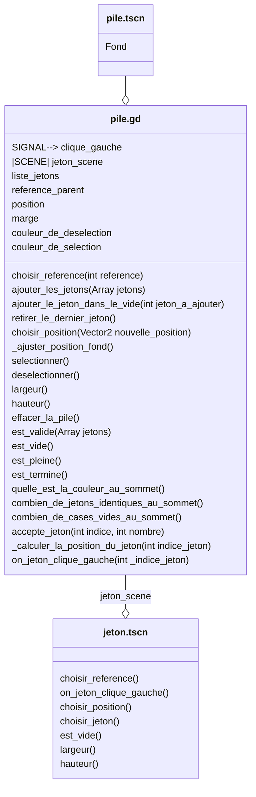

# Scene "Pile"

## Description

Cette classe correspond à la scene d'une pile. La pile contient de jetons qui ont chacun une apparence propre. C'est un element de jeu autonome qui a ses propres regles de modifications.

## Diagramme de classe

