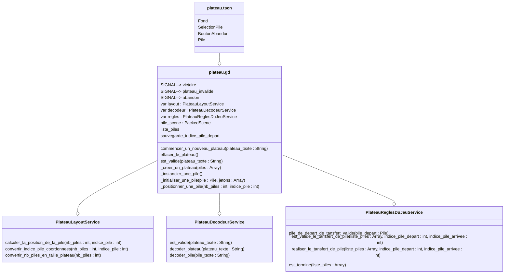

# Scene "Plateau"

## Description

Cette classe correspond à la scène principale du plateau de jeu. Elle gère les piles, les règles du jeu, le décodage des plateaux, et leur disposition à l'écran.

## Diagramme de classe

## Détails des noeuds dans plateau.tscn

- **Plateau (Node)** : Racine de la scène.
- **Fond (ColorRect)** : Fond du plateau, utilisé pour l'affichage principal.
- **SelectionPile (Timer)** : Minuteur pour gérer les sélections temporaires de piles.
- **BoutonAbandon (Button)** : Bouton permettant d'abandonner la partie.
- **Pile (PackedScene)** : Scène externe représentant une pile, instanciée dynamiquement.

## Propriétés importantes dans plateau.gd

- **layout** : Service pour calculer les positions des piles.
- **decodeur** : Service pour décoder les plateaux à partir de chaînes de caractères.
- **regles** : Service pour appliquer les règles du jeu.
- **pile_scene** : Référence à la scène "Pile" utilisée pour créer les piles.
- **liste_piles** : Liste des piles actuellement sur le plateau.
- **sauvegarde_indice_pile_depart** : Indice de la pile de départ pour les transferts.

## Signaux

- **victoire** : Signal émis lorsqu'une victoire est détectée.
- **plateau_invalide** : Signal émis lorsqu'un plateau invalide est détecté.
- **abandon** : Signal émis lorsqu'un joueur abandonne la partie.

## Méthodes principales

- **commencer_un_nouveau_plateau(plateau_texte : String)** : Initialise un nouveau plateau à partir d'une chaîne de caractères.
- **effacer_le_plateau()** : Efface toutes les piles du plateau.
- **est_valide(plateau_texte : String)** : Vérifie si un plateau est valide.
- **_creer_un_plateau(piles : Array)** : Crée un plateau à partir d'une liste de piles.
- **_instancier_une_pile()** : Instancie une nouvelle pile.
- **_initialiser_une_pile(pile : Pile, jetons : Array)** : Initialise une pile avec des jetons.
- **_positionner_une_pile(nb_piles : int, indice_pile : int)** : Calcule et applique la position d'une pile sur le plateau.

## Services associés

### PlateauDecodeurService

- **est_valide(plateau_texte : String)** : Vérifie si un plateau est valide.
- **decoder_plateau(plateau_texte : String)** : Décode un plateau à partir d'une chaîne de caractères.
- **decoder_pile(pile_texte : String)** : Décode une pile à partir d'une chaîne de caractères.

### PlateauLayoutService

- **calculer_la_position_de_la_pile(nb_piles : int, indice_pile : int)** : Calcule la position d'une pile sur le plateau.
- **convertir_indice_pile_coordonnees(nb_piles : int, indice_pile : int)** : Convertit un indice de pile en coordonnées.
- **convertir_nb_piles_en_taille_plateau(nb_piles : int)** : Convertit le nombre de piles en dimensions de plateau.

### PlateauReglesDuJeuService

- **pile_de_depart_de_tansfert_valide(pile_depart : Pile)** : Vérifie si une pile de départ est valide pour un transfert.
- **est_valide_le_tansfert_de_pile(liste_piles : Array, indice_pile_depart : int, indice_pile_arrivee : int)** : Vérifie si un transfert de pile est valide.
- **realiser_le_tansfert_de_pile(liste_piles : Array, indice_pile_depart : int, indice_pile_arrivee : int)** : Réalise un transfert de pile.
- **est_termine(liste_piles : Array)** : Vérifie si la partie est terminée.