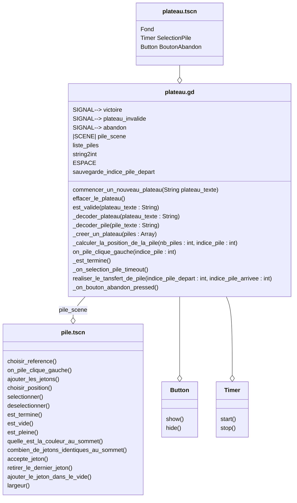

# Scene "Plateau"

## Description

Cette classe correspond à la scene d'un plateau de jeu. Le plateau de jeu contient des piles de jetons qui contient des jetons. C'est l'espace dans lequel le joueur va tenter de résoudre le défi proposé. 

## Diagramme de classe

