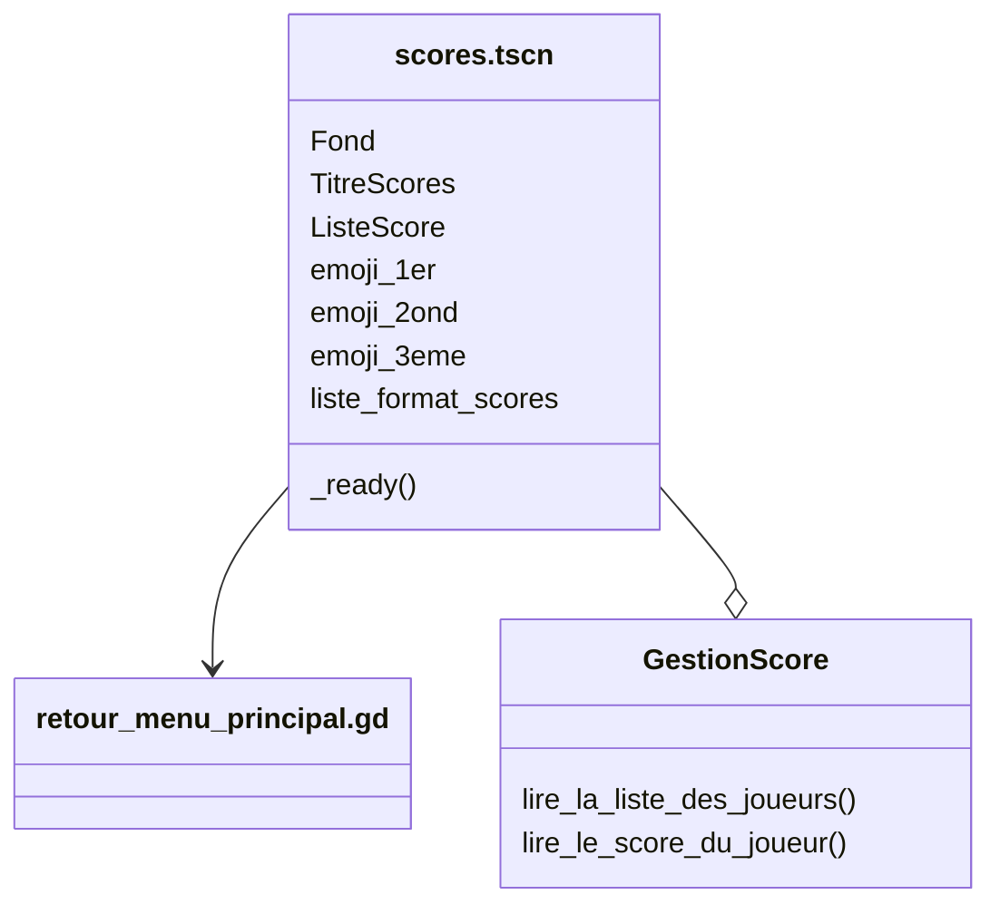

# Scene "Scores"

## Description

Cette classe correspond à la scene des scores. Consuklte la liste de joueurs et les classes selon leur score et attribue un trophé au podium.

## Diagramme de classe

