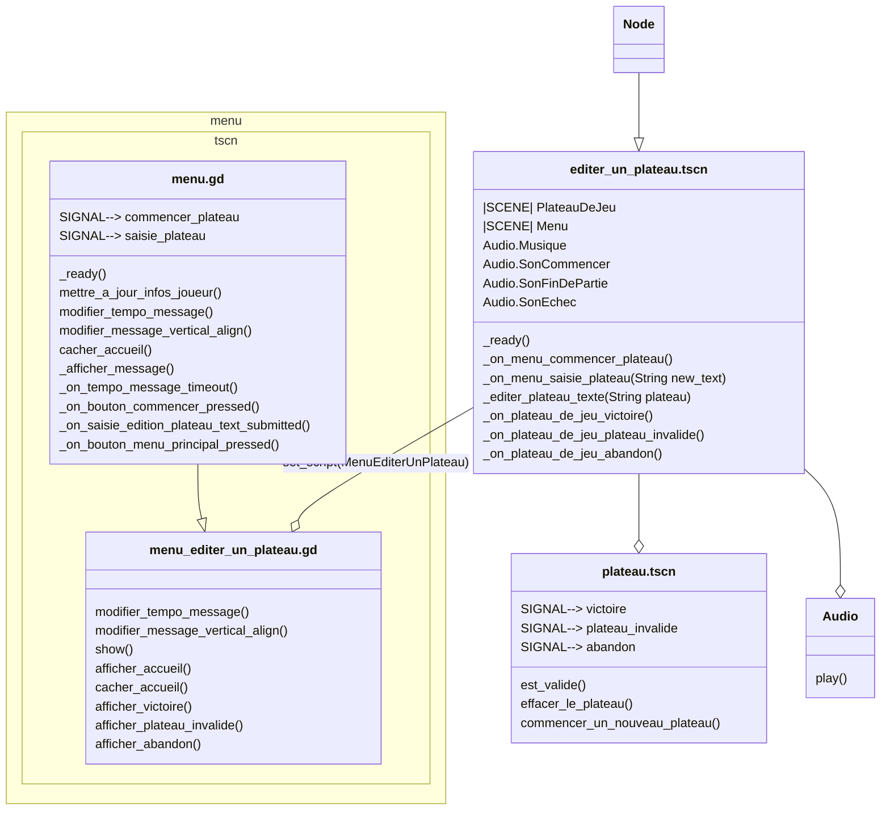

# Scene "EditerUnPlateau"

## Description

Cette classe correspond à la scène d'édition libre d'un plateau pour y jouer.

## Diagramme de classe

```mermaid
classDiagram
class editer_un_plateau.tscn {
    |SCENE| PlateauDeJeu
    |SCENE| Menu
    Audio.Musique
    Audio.SonCommencer
    Audio.SonFinDePartie
    Audio.SonEchec
    _ready()
    _on_menu_commencer_plateau()
    _on_menu_saisie_plateau(String new_text)
    _editer_plateau_texte(String plateau)
    _on_plateau_de_jeu_victoire()
    _on_plateau_de_jeu_plateau_invalide()
    _on_plateau_de_jeu_abandon()
}

    Node --|> editer_un_plateau.tscn
    editer_un_plateau.tscn --o plateau.tscn
    editer_un_plateau.tscn --o menu_editer_un_plateau.gd : set_script(MenuEditerUnPlateau)
    menu.gd --|> menu_editer_un_plateau.gd
    editer_un_plateau.tscn --o Audio


namespace menu.tscn {
    class menu.gd {
        SIGNAL--> commencer_plateau
        SIGNAL--> saisie_plateau
        _ready()
        mettre_a_jour_infos_joueur()
        modifier_tempo_message()
        modifier_message_vertical_align()
        cacher_accueil()
        _afficher_message()
        _on_tempo_message_timeout()
        _on_bouton_commencer_pressed()
        _on_saisie_edition_plateau_text_submitted()
        _on_bouton_menu_principal_pressed()
    }
    
    class menu_editer_un_plateau.gd {
        modifier_tempo_message()
        modifier_message_vertical_align()
        show()
        afficher_accueil()
        cacher_accueil()
        afficher_victoire()
        afficher_plateau_invalide()
        afficher_abandon()
    }
}


class plateau.tscn {
    SIGNAL--> victoire
    SIGNAL--> plateau_invalide
    SIGNAL--> abandon
    est_valide()
    effacer_le_plateau()
    commencer_un_nouveau_plateau()
}

class Audio { play() }
```